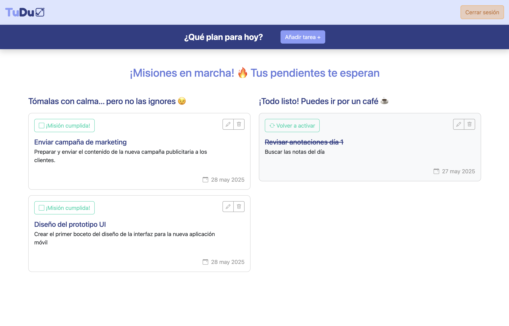
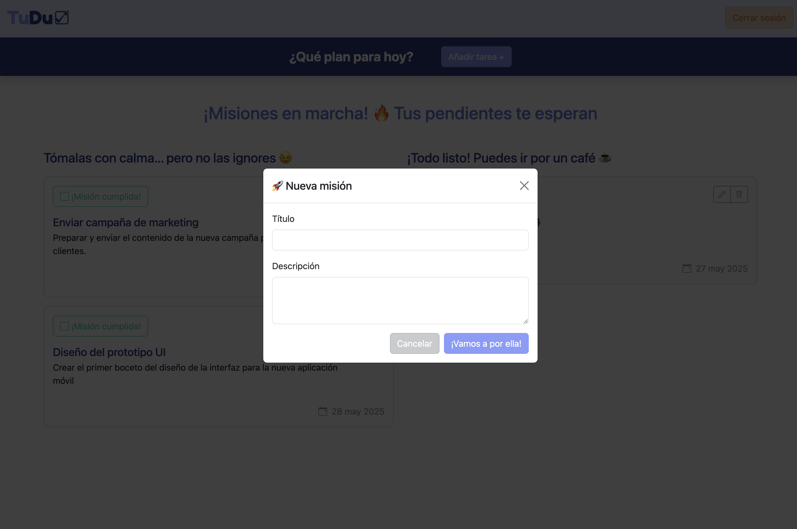
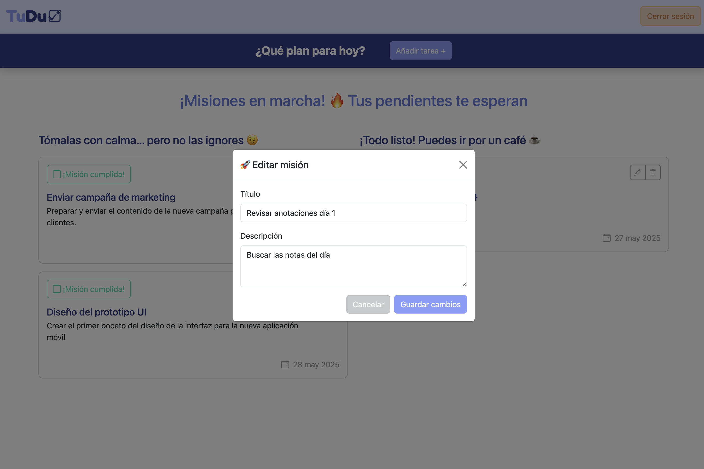

# 🗂️ TuDuProject

TuDuProject es una aplicación web para gestionar tareas de forma sencilla, rápida y con una interfaz amigable. Permite a los usuarios autenticarse, crear, editar, marcar como completadas y eliminar tareas personales. ¡Ideal para mantener tus pendientes bajo control!

🔗 **Demo en producción**: [https://tuduproject.netlify.app]
🔗 **Presentación**: [https://www.figma.com/deck/Ih1Ty15EUaiRElPwwdes5y] 
---

## 🧰 Tech Stack

* ⚙️ **Frontend**: Vue 3 + Vite
* 🧠 **Estado global**: Pinia + pinia-plugin-persist
* 🎨 **Estilos**: Bootstrap 5
* 💃 **Backend como servicio**: Supabase (auth + base de datos)
* 🌍 **Deploy**: Netlify

---

## 🛠️ Instrucciones para correr localmente

```bash
# 1. Clona este repositorio
git clone https://github.com/tuusuario/tuduproject.git
cd tuduproject

# 2. Instala dependencias
npm install

# 3. Crea un archivo .env con tus claves de Supabase
VITE_SUPABASE_URL=https://<tu-url>.supabase.co
VITE_SUPABASE_KEY=<tu-api-key>

# 4. Corre el servidor de desarrollo
npm run dev
```

---

## 🔄 Estructura de funcionalidades

* Autenticación: Sign up, login, logout (con Supabase)
* Protección de rutas (solo usuarios logueados)
* CRUD de tareas por usuario

  * Crear nueva tarea
  * Editar tarea existente
  * Marcar como completada/incompleta
  * Eliminar tarea
* Orden automático de tareas (más recientes primero)
* Persistencia de sesión con Pinia
* UI con modales para crear/editar tareas

---

## 📸 Capturas 

* 
* 
* 
* 

---

## 📦 Deploy (Netlify)

* **Build command**: `npm run build`
* **Publish directory**: `dist`
* En `/public` agrega el archivo `_redirects` con el contenido:

  ```
  /*    /index.html   200
  ```

---

## ✍️ Autor

Hecho por [Ariadna Flores](https://github.com/AryFlo) — proyecto final del módulo Vue + Supabase.

---

